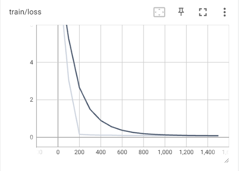

# FineTuned LLM Code Translation with GPT-2

This model is my first iteration at a code converter from Python to JavaScript, focusing on their idiomatic structures. It uses a causal language model trained using the Hugging Face Transformers library, and the XLCoST dataset for evalution. It could also be generalized for translation between other languages in the dataset by instead training with C++, C, C#, PHP, or Java.

Requirements: Python 3.x, PyTorch or TensorFlow, Hugging Face Transformers, TensorBoard (optional for monitoring)

Full training takes ~400 hours, but a fine-tuned model for testing is available [here](https://drive.google.com/file/d/1StssicPKygAlmzitEvk2kmq87UCZVN21/view?usp=drive_link), including logs and checkpoints (~10G). More detail on the quick-test below



Example prompt with 2000 steps (~37 hours of training):

```
"translate this Python code to JavaScript: def findNthNumber ( N ) : NEW_LINE result = 0 NEW_LINE p = 1 NEW_LINE while ( N > 0 ) : NEW_LINE result += ( p * ( N % 9 ) ) NEW_LINE N = N // 9 NEW_LINE p = p * 10 NEW_LINE return result NEW_LINE if __name__ == ' _ _ main _ _ ' : NEW_LINE INDENT N = 9 NEW_LINE print ( findNthNumber ( N ) ) NEW_LINE DEDENT"
```

Output:

```
Train Python size: 67219
Sample Train Python data: ['def maxPresum ( a , b ) : NEW_LINE', 'X = max ( a [ 0 ] , 0 ) NEW_LINE', 'for
Train JavaScript size: 67219
Sample Train JavaScript data: ['function maxPresum ( a , b ) {', 'let X = Math . max ( a [ 0 ] , 0 ) ;', 
Eval Python size: 6861
Sample Eval Python data: ['def minSum ( A , N ) : NEW_LINE', 'mp = { } NEW_LINE sum = 0 NEW_LINE', 'for i
Eval JavaScript size: 6861
Sample Eval JavaScript data: ['function minSum ( A , N ) {', 'let mp = new Map ( ) ; let sum = 0 ;', 'for
Train encodings keys: dict_keys(['input_ids', 'attention_mask'])
Eval encodings keys: dict_keys(['input_ids', 'attention_mask'])
Train dataset size: 4000
Eval dataset size: 4000
{'loss': 8.9209, 'learning_rate': 1.0000000000000001e-07, 'epoch': 0.0}
{'loss': 3.0525, 'learning_rate': 1e-05, 'epoch': 0.2}
{'eval_loss': 0.2849847972393036, 'eval_runtime': 2159.3111, 'eval_samples_per_second': 1.852, 'eval_step
{'loss': 0.1566, 'learning_rate': 2e-05, 'epoch': 0.4}
{'eval_loss': 0.22789107263088226, 'eval_runtime': 2169.0045, 'eval_samples_per_second': 1.844, 'eval_ste
{'loss': 0.1293, 'learning_rate': 3e-05, 'epoch': 0.6}
{'eval_loss': 0.21480068564414978, 'eval_runtime': 32568.4546, 'eval_samples_per_second': 0.123, 'eval_st
{'loss': 0.1164, 'learning_rate': 4e-05, 'epoch': 0.8}
{'eval_loss': 0.20747026801109314, 'eval_runtime': 2548.1483, 'eval_samples_per_second': 1.57, 'eval_step
{'loss': 0.113, 'learning_rate': 5e-05, 'epoch': 1.0}
{'eval_loss': 0.20349769294261932, 'eval_runtime': 2245.2736, 'eval_samples_per_second': 1.782, 'eval_ste
{'loss': 0.1006, 'learning_rate': 4.5e-05, 'epoch': 1.2}
{'eval_loss': 0.20346783101558685, 'eval_runtime': 2163.7216, 'eval_samples_per_second': 1.849, 'eval_ste
{'loss': 0.0972, 'learning_rate': 4e-05, 'epoch': 1.4}
{'eval_loss': 0.20230120420455933, 'eval_runtime': 2401.8994, 'eval_samples_per_second': 1.665, 'eval_ste
{'loss': 0.0997, 'learning_rate': 3.5e-05, 'epoch': 1.6}
{'eval_loss': 0.19870145618915558, 'eval_runtime': 2513.5235, 'eval_samples_per_second': 1.591, 'eval_ste
{'loss': 0.0933, 'learning_rate': 3e-05, 'epoch': 1.8}
{'eval_loss': 0.19930768013000488, 'eval_runtime': 2530.3526, 'eval_samples_per_second': 1.581, 'eval_ste
{'loss': 0.0936, 'learning_rate': 2.5e-05, 'epoch': 2.0}
{'eval_loss': 0.19808875024318695, 'eval_runtime': 2352.3068, 'eval_samples_per_second': 1.7, 'eval_steps
{'loss': 0.0894, 'learning_rate': 2e-05, 'epoch': 2.2}
{'eval_loss': 0.1987968534231186, 'eval_runtime': 2285.797, 'eval_samples_per_second': 1.75, 'eval_steps_
████████████████████████████████████████████████████████████████████████████████████████████| 1500/1500 [0 [36:59:14<00:00, 18.58s/it]
 20%|███████████████████████████████████████▍
                                                               | 100/500 [06:52<28:05,  4.21s/it]
 20%|███████████████████▉                                                                               | 101/500 [06:56<28:44,  4.32s/it] 
 22%|█████████████████████▉                                                                             | 111/500 [07:40<27:46,  4.28s/it] 
258.2788, 'eval_samples_per_second': 1.771, 'eval_steps_per_second': 0.221, 'epoch': 3.0}
{'train_runtime': 135412.5071, 'train_samples_per_second': 0.089, 'train_steps_per_second': 0.011, 'train_loss': 0.30174195480346677, 'epoch': 3.0}
100%|██████████████████████████████████████████████████████████████████████████████████████████████| 1500/1500 [37:36:52<00:00, 90.28s/it]
100%|███████████████████████████████████████████████████████████████████████████████████████████████████| 500/500 [38:47<00:00,  4.66s/it]
Generated text: function findNthNumber ( N ) {
let result = 0 ; let p = 1 ;
while ( N > 0 ) {
result += ( p * ( N % 9 ) ) ;
N = parseInt ( N / 9 , 10 ) ;
p = p * 10 ; }
return result ; }
let N = 9 ; document . write ( findNthNumber ( N ) ) ;
```
